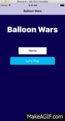

# Capstone

 I wanted to build a Native Application using React-Native, so I designed and developed this project to familiarize myself with iOS tech and to couple this with my React projects. It is not yet on the app store but should be shortly.

 Main Tech I used is React-Native, Xcode, and Node.js
 Future Concepts: Phone Vibration, Multi player with Sockets, Special Balloons

## How to Use
npm i -g react-native-cli
fork and clone this repo
react-native run-ios

Download react-native and run using react-native run-ios. I am using xCode to build it out locally.
